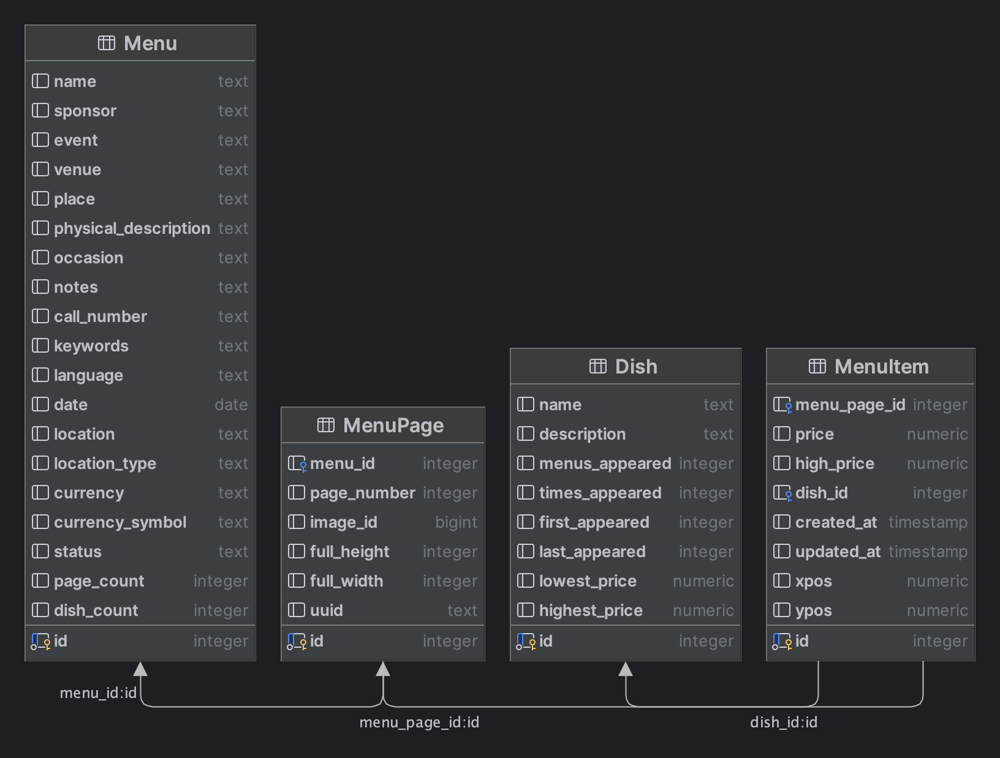

# Project Phase-I Report
_Note_: Damir, can you put the image of the janitor somewhere around here? :D
## Team 63 - The Data Janitors
- Trish Le - tle87@illinois.edu
- Salvador Tranquilino-Ramos - stran42@illinois.edu
- Damir Temir - dtemi2@illinois.edu

## Description of Dataset
Our team was provided with the following dataset files, each representing a separate data table:
- MenuPage.csv
- MenuItem.csv
- Menu.csv
- Dish.csv

### Database Schema
Here’s the database schema that represents the relation between the tables with primary key and foreign key ids:

_Note:_ Change Dish(first_appeared) and Dish(last_appeared) to ISO date format?

### Narrative Description (covering structure and content):
_Note:_ Damir searches for where they may be getting the data from and puts down some content:
https://www.kaggle.com/datasets/nypl/whats-on-the-menu/data

_Note:_ Updated 5 years ago and the data we were given was uploaded by the professor in 2021. It is similar to our data, but we need to check whether or not it is exactly the same if we decide to reference Kaggle’s data explorer.
https://menus.nypl.org/data

_Note:_ Everyone should look into understanding the dataset

## Use Cases
### Target (Main) Use Case U1:
_Note:_ Everyone put an idea down on what it should look like (make sure to include what data cleaning you think is necessary and why it’s sufficient)
- Idea 1
- Idea 2...
### "Zero Data Cleaning" Use Case U0:
_Note:_ Damir will come up with an idea
- Idea 1
- Idea 2...
### "Never Enough" Use Case U2:
_Note:_ Salvador will come up with an idea
- Idea 1
- Idea 2...

## Data Quality Problems

### 1. Dish Table
#### 1.1 The "description" column has 100% missing values
The **“description”** column should be removed; it is unnecessary with 100% missing values.
_Evidence:_ [Link](https://github.com/trish-le/CS513/blob/main/Data%20Profiling/dish_summary.ipynb)

_Note:_ Need to label the graphs/charts in the Jupyter notebooks on GitHub
#### 1.2 Data Quality Problem (change this header name)
**“lowest_price”** and **“highest_price”** columns each have ~6.87% missing values; these rows may be unnecessary based on what we are trying to analyze.
#### 1.3 Data Quality Problem (change this header name)
**“id”** column does not contain all values within its range (min: 1, max: 515677, total records: 423397); may lead to foreign key violations
#### 1.4 Data Quality Problem (change this header name)
**“menus_appeared”** and **“times_appeared”** columns have numerous outliers; should double check these values to ensure data accuracy
#### 1.5 Data Quality Problem (change this header name)
**“first_appeared”** and “**last_appeared”** columns have some outliers that are invalid years; should make these values null
#### 1.6 Data Quality Problem (change this header name)
**“first_appeared”** and **“last_appeared”** columns are recognized as integers in DataGrip and Text in OpenRefine; should make these values ISO timestamps to allow parsing
#### 1.7 Data Quality Problem (change this header name)
**“lowest_price”** and **“highest_price”** columns have unusually low price quartiles and some outliers; should double check whether prices align with the corresponding year

### 2. Menu Table
#### 2.1 Data Quality Problem (change this header name)
**“keywords”**, **“language”**, and **“location_type”** columns should be removed; it is unnecessary with 100% missing values
#### 2.2 Data Quality Problem (change this header name)
**“name”**, **“sponsor”**, **“event”**, **“venue”**, **“place”**, **“physical_description”**, **“occasion”**, **“notes”**, **“call_number”**, **“date”**, **“currency”**, and **“currency_symbol”** each have ~3.34% to ~81.78% of missing values; some rows may be unnecessary based on what we are trying to analyze

### 3. MenuItem Table
#### 3.1 Data Quality Problem (change this header name)
**“price”** and **“high_price”** each have ~33.46% to ~93.1% missing values; these rows may be unnecessary based on what we are trying to analyze
#### 3.2 Data Quality Problem (change this header name)
**“menu_page_id”** has numerous values that does not exist in the MenuPage table; this leads to foreign key violations

### 4. MenuPage Table
#### 4.1 Data Quality Problem (change this header name)
**“page_number”** has 1.8% missing values; some rows may be unnecessary based on what we are trying to analyze
#### 4.2 Data Quality Problem (change this header name)
**“menu_id”** column has numerous values that does not exist in the Menu table; this leads to foreign key violations

## Initial Plan for Phase-II
_Note:_ Deadline for Step 4 is June 21, 2024
